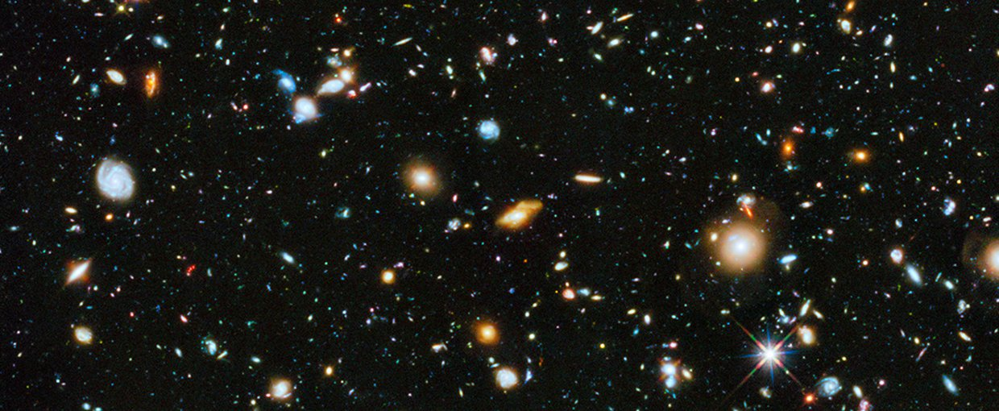
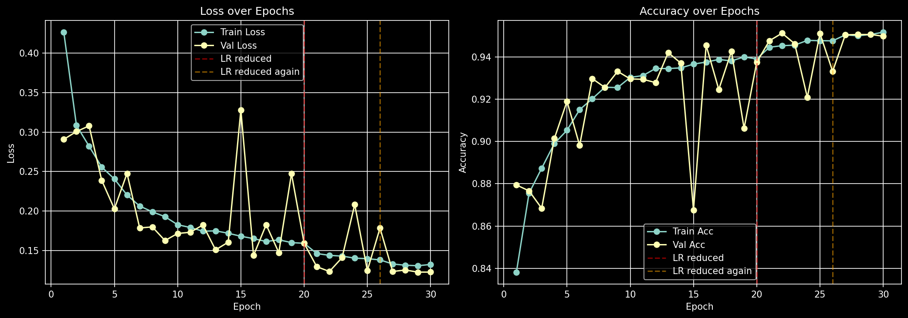
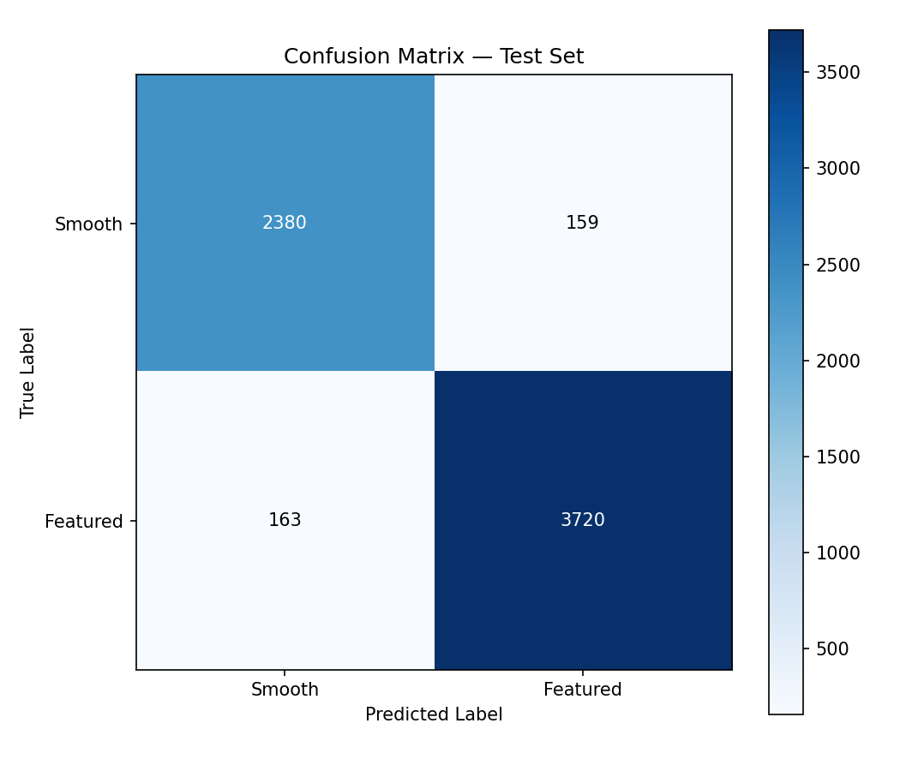

# 🌌 Galaxy Morphology Classifier

> *A convolutional neural network trained from scratch to classify galaxy morphology using real citizen-science data.*



[]()
[]()
[]()
[]()
[]()

---

## Overview

This project trains a custom CNN to classify galaxy images as either **smooth/elliptical** or **featured/spiral** using the [Galaxy Zoo 2](https://www.kaggle.com/c/galaxy-zoo-the-galaxy-challenge) dataset — 61,578 real galaxy images collected from the Sloan Digital Sky Survey (SDSS) and labelled by hundreds of thousands of citizen science volunteers.

The model achieves **94.99% accuracy on a held-out test set** with balanced precision and recall across both classes, trained entirely from scratch without transfer learning.

---

## Results

| Metric | Value |
|--------|-------|
| Test Accuracy | **94.99%** |
| Test Samples | 6,422 |
| Best Val Loss | 0.1225 |
| Smooth Precision / Recall | 0.94 / 0.94 |
| Featured Precision / Recall | 0.96 / 0.96 |
| Training Time per Epoch | ~37 seconds (RTX 3090) |

### Learning Curves



The learning rate scheduler (`ReduceLROnPlateau`) reduced the LR from `3e-4 → 1.5e-4 → 7.5e-5` across training, visibly improving convergence in later epochs.

### Confusion Matrix



The model makes near-symmetric errors across both classes — 159 smooth galaxies misclassified as featured and 163 featured galaxies misclassified as smooth — indicating no class bias.

---

## Why This Project

Galaxy morphology is a fundamental astrophysical property. A galaxy's shape encodes its formation history, star-formation rate, and environmental interactions. The SDSS has catalogued hundreds of millions of galaxies — far more than humans can manually classify. Projects like Galaxy Zoo crowd-sourced this at scale; deep learning is the logical next step.

Beyond the science, this project demonstrates a complete, production-style ML pipeline: raw messy probabilistic labels → label engineering → custom architecture → GPU training → rigorous evaluation on a held-out test set.

---

## Label Engineering

The raw Galaxy Zoo 2 labels are **probabilistic**, not categorical. Each galaxy has 37 columns representing the fraction of volunteers who chose each answer in an 11-question decision tree.

To convert these into hard training labels:

1. Extracted `Class1.1` (smooth) and `Class1.2` (featured) — the two Question 1 columns
2. Assigned the class with the highest volunteer agreement via `idxmax`
3. Applied a **0.65 confidence threshold** — galaxies where neither class exceeded this were excluded as too ambiguous to train on reliably
4. Dropped the artifact class (`Class1.3`) — only 11 samples after filtering, insufficient for meaningful learning

This filtering reduced the dataset from 61,578 to ~34,244 samples with a 40/60 smooth/featured split — a manageable class imbalance requiring no special handling.

---

## Architecture

A four-block custom CNN built entirely from scratch:

```
Input: (3, 224, 224)
       │
       ▼
Conv Block 1: Conv2d(3→32) → BatchNorm → ReLU → MaxPool   →  (32, 112, 112)
Conv Block 2: Conv2d(32→64) → BatchNorm → ReLU → MaxPool  →  (64, 56, 56)
Conv Block 3: Conv2d(64→128) → BatchNorm → ReLU → MaxPool →  (128, 28, 28)
Conv Block 4: Conv2d(128→256) → BatchNorm → ReLU → MaxPool → (256, 14, 14)
       │
       ▼
Flatten → Linear(50176 → 512) → ReLU → Dropout(0.5) → Linear(512 → 2)
       │
       ▼
Output: 2 logits (Smooth | Featured)
```

**Total parameters: 26,081,026**

### Design Decisions

**Built from scratch, not transfer learning** — the goal was to understand what the network actually learns: how early layers detect edges and brightness gradients, and how deeper layers compose these into abstract morphological features like spiral arms. A pretrained backbone would obscure this.

**BatchNorm after every conv layer** — stabilises activations throughout the network depth, enabling faster and more stable convergence.

**Dropout(0.5) in the classifier head** — the primary regularisation mechanism. With 26M parameters and ~27k training samples, overfitting is the main risk.

**Domain-specific augmentation** — `RandomHorizontalFlip`, `RandomVerticalFlip`, and `RandomRotation(180)` reflect a real physical property: galaxies have no preferred orientation in the sky.

---

## Training Setup

| Hyperparameter | Value |
|----------------|-------|
| Optimizer | Adam |
| Initial Learning Rate | 3e-4 |
| Scheduler | ReduceLROnPlateau (patience=3, factor=0.5) |
| Early Stopping | patience=5 |
| Batch Size | 64 |
| Max Epochs | 30 |
| Loss Function | CrossEntropyLoss |

**Data split:** 70% train / 15% val / 15% test — splits are fixed with `random_state=42` for reproducibility. The test set was held out entirely and only evaluated once after training completed.

**Normalisation:** Mean and std computed directly from the training set (`[0.0448, 0.0396, 0.0295]`, `[0.0878, 0.0729, 0.0646]`), not ImageNet values — galaxy images have a fundamentally different pixel distribution (mostly dark space with bright centres).

---

## Project Structure

```
GalaxyClassifier/
│
├── assets/
│   ├── confusion_matrix.png
│   └── learning_curves.png
│
├── data/                              # excluded from git
│   ├── images/
│   │   └── train/
│   │       ├── images_training_rev1/  # original 424×424 JPGs
│   │       └── images_resized/        # pre-resized 224×224 JPGs
│   ├── train.csv
│   ├── val.csv
│   └── test.csv
│
├── notebooks/
│   ├── exploration.ipynb              # EDA & label engineering
│   └── performance_eval.ipynb        # learning curve visualisation
│
├── dataset.py                         # PyTorch Dataset class
├── model.py                           # GalaxyCNN architecture
├── engine.py                          # train/val loop functions
├── train.py                           # training entry point
├── evaluate.py                        # test set evaluation & confusion matrix
├── prepare_data.py                    # one-time data preprocessing & resizing
│
├── best_model.pth                     # saved model weights
├── training_history.pt                # loss/accuracy history
├── galaxy_stats.pt                    # dataset mean & std
├── requirements.txt
└── README.md
```

---

## Getting Started

### 1. Clone the repository

```bash
git clone https://github.com/YOUR_USERNAME/GalaxyClassifier.git
cd GalaxyClassifier
```

### 2. Create a virtual environment

```bash
python -m venv venv311
# Windows
venv311\Scripts\activate
# macOS/Linux
source venv311/bin/activate
```

### 3. Install dependencies

```bash
# PyTorch with CUDA 12.6
pip install torch torchvision torchaudio --index-url https://download.pytorch.org/whl/cu126

# Other dependencies
pip install -r requirements.txt
```

### 4. Download the dataset

You'll need a [Kaggle API token](https://www.kaggle.com/docs/api). Once configured:

```bash
kaggle competitions download -c galaxy-zoo-the-galaxy-challenge
unzip galaxy-zoo-the-galaxy-challenge.zip -d data/
```

### 5. Prepare the data

Cleans labels, applies the confidence threshold, creates train/val/test splits, and pre-resizes all images to 224×224:

```bash
python prepare_data.py
```

### 6. Train

```bash
python train.py
```

### 7. Evaluate

```bash
python evaluate.py
```

Prints accuracy, precision, recall and F1 per class, and saves `assets/confusion_matrix.png`.

---

## Tech Stack

| Component | Technology |
|-----------|-----------|
| Language | Python 3.11 |
| Deep Learning | PyTorch 2.x |
| GPU Acceleration | CUDA 12.6 |
| Data Processing | pandas, NumPy |
| Image Handling | PIL, torchvision |
| Visualisation | Matplotlib |
| Metrics | scikit-learn |
| Hardware | NVIDIA GeForce RTX 3090 (24GB) |

---

## Future Work

- **Probabilistic label modelling** — instead of hard labels, predict the full volunteer distribution using KL divergence loss. This treats label uncertainty as signal rather than noise.
- **Transfer learning comparison** — fine-tune a pretrained ResNet-18 as a performance baseline against the custom CNN.
- **Extended classification** — expand to the full Galaxy Zoo 2 decision tree for multi-class morphology prediction (bars, rings, edge-on disks etc).
- **Dataset expansion** — experiment with [Galaxy10 DECals](https://astronn.readthedocs.io/en/latest/galaxy10.html), a cleaner 10-class dataset.

---

## Acknowledgements

- [Galaxy Zoo 2](https://www.zooniverse.org/projects/zookeeper/galaxy-zoo/) and the Zooniverse citizen science community
- [Kaggle Galaxy Zoo Challenge](https://www.kaggle.com/c/galaxy-zoo-the-galaxy-challenge)
- Sloan Digital Sky Survey (SDSS)

---